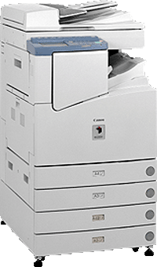

# Sales Analysis of Superstore Dataset
## Overview
This project analyzes sales data from a Superstore dataset to provide insights into product performance, customer segments, and regional sales.

The goal is to help the company understand which products, categories, regions, and customer segments to target or avoid, and to identify trends that can improve profitability.

**The analysis includes:**
* Sales and profit by category and sub-category
* Customer segment performance
* Top cities and products by sales 
* Impact of discounts on profitability

## Dataset
The dataset was sourced from Kaggle and includes:
| Column Name   | Description                                         |
| ------------- | --------------------------------------------------- |
| Row ID        | Unique ID for each row                              |
| Order ID      | Unique order identifier                             |
| Order Date    | Date of the order                                   |
| Ship Date     | Date of shipment                                    |
| Ship Mode     | Shipping method                                     |
| Customer ID   | Unique customer identifier                          |
| Customer Name | Name of the customer                                |
| Segment       | Customer segment (Consumer, Corporate, Home Office) |
| Country       | Country of residence                                |
| City          | City of the customer                                |
| State         | State of residence                                  |
| Postal Code   | Postal code                                         |
| Region        | Customer region                                     |
| Product ID    | Unique product identifier                           |
| Category      | Product category                                    |
| Sub-Category  | Product sub-category                                |
| Product Name  | Name of the product                                 |
| Sales         | Sales value                                         |
| Quantity      | Quantity sold                                       |
| Discount      | Discount applied                                    |
| Profit        | Profit or loss incurred                             |

### Tools & Technologies

* Python
* Pandas for data manipulation
* Matplotlib for visualization
* CSV data file

## Key Insights
*(Check the Analysis folder)*

  
The analysis of sales data reveals that Technology is the top-selling category, generating $836,154 in total sales, and it is also the most profitable, with profits of around $145,454. Within Technology, Phones lead the sales with $330,000.

Among customer segments, Consumers are the main buyers, contributing over $1.16 million in sales. The cities with the highest sales are New York City ($256,368), Los Angeles ($175,851), and Seattle ($119,540).

The Canon imageCLASS 2200 Advanced Copier is the top-selling product ($61,600), reflecting strong demand for high-tech office equipment.

Finally, the analysis shows a weak negative correlation (-0.2195) between discounts and profit, indicating that offering higher discounts slightly reduces profitability.

#### Author
Stivens Vega Garcia
